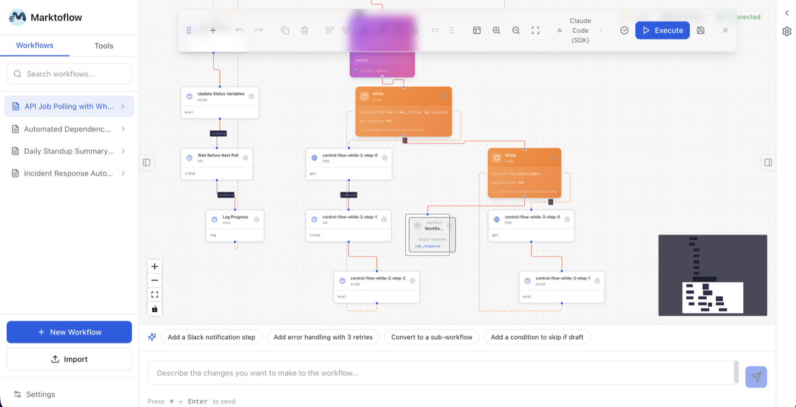

<p align="center">
  
</p>

<h1 align="center">marktoflow</h1>

<p align="center">
  <strong>Open-source workflow automation where your workflows are just markdown files.</strong>
</p>

<p align="center">
  38 native integrations. Built-in AI agent support. Visual editor. No vendor lock-in.
</p>

<p align="center">
  <a href="https://www.npmjs.com/package/@marktoflow/marktoflow"></a>
  <a href="https://github.com/marktoflow/marktoflow/blob/main/LICENSE"></a>
  <a href="https://github.com/marktoflow/marktoflow/stargazers"></a>
  <a href="https://github.com/marktoflow/marktoflow/actions"></a>
  <a href="https://www.npmjs.com/package/@marktoflow/marktoflow"></a>
</p>

<p align="center">
  
</p>

<p align="center">
  <em>Visual workflow designer — drag-and-drop nodes, AI-assisted editing, one-click execution</em>
</p>

---

## Quick Start

```bash
npm install -g @marktoflow/marktoflow

marktoflow init

marktoflow run workflow.md
```

That's it. Your workflow is a markdown file with YAML frontmatter:

```yaml
---
workflow:
  id: hello-world
  name: Hello World

tools:
  slack:
    sdk: '@slack/web-api'
    auth:
      token: '${SLACK_BOT_TOKEN}'

steps:
  - action: slack.chat.postMessage
    inputs:
      channel: '#general'
      text: 'Hello from marktoflow!'
---
```

## Why marktoflow?

| | What you get |
|---|---|
| **Markdown-native** | Workflows are `.md` files — readable, diffable, version-controlled |
| **MCP-first** | Native Model Context Protocol support with zero config |
| **Direct SDK calls** | Official SDKs, full TypeScript types, no wrapper APIs |
| **AI agents included** | Use your existing Copilot/Claude/Codex subscriptions — no extra API keys |
| **Visual editor** | Optional drag-and-drop GUI with `marktoflow gui` |
| **Cost tracking** | Know exactly what each workflow run costs |

## How it compares

| Feature | marktoflow | Zapier | n8n | GitHub Actions |
|---------|:----------:|:------:|:---:|:--------------:|
| Open source | Yes | No | Yes | No |
| Workflow format | Markdown | Proprietary | JSON | YAML |
| Version control | Git-native | No | Limited | Git-native |
| AI agent support | Built-in | Add-on | Plugin | Limited |
| Direct SDK access | Yes | No | No | Via actions |
| Visual editor | Yes | Yes | Yes | No |
| Self-hosted | Yes | No | Yes | Runners only |
| Per-task pricing | Free | Yes | Free (self-host) | Minutes-based |

## Integrations

38 native SDK integrations — all with TypeScript types, retry logic, and input validation.

| Category | Services |
|----------|----------|
| **Communication** | Slack, Teams, Discord, Telegram, WhatsApp, Twilio |
| **Email** | Gmail, Outlook, SendGrid, Mailchimp |
| **Google Workspace** | Sheets, Calendar, Drive, Docs |
| **Project Management** | Jira, Linear, Asana, Trello |
| **Knowledge** | Notion, Confluence |
| **Developer** | GitHub, Airtable |
| **Payments** | Stripe, Shopify |
| **Support** | Zendesk |
| **Storage** | Dropbox, AWS S3 |
| **Databases** | Supabase, PostgreSQL, MySQL |
| **Universal** | HTTP client (any REST API) |
| **AI Agents** | GitHub Copilot, Claude Code, OpenAI Codex, OpenCode, Ollama |

## Packages

| Package | Description |
|---------|-------------|
| [`@marktoflow/marktoflow`](packages/marktoflow) | All-in-one install (CLI + GUI + integrations) |
| [`@marktoflow/core`](packages/core) | Parser, engine, state management, plugin system |
| [`@marktoflow/cli`](packages/cli) | Command-line interface and workflow runner |
| [`@marktoflow/gui`](packages/gui) | Visual workflow designer (web UI) |
| [`@marktoflow/integrations`](packages/integrations) | 38 service integrations and AI adapters |

## Examples

Production-ready workflow templates in [`examples/`](examples/):

- **[codebase-qa](examples/codebase-qa/)** — AI-powered Q&A via Slack/Telegram
- **[copilot-code-review](examples/copilot-code-review/)** — PR review with GitHub Copilot
- **[daily-standup](examples/daily-standup/)** — Jira + Slack standup automation
- **[incident-response](examples/incident-response/)** — Multi-service incident coordination
- **[approval-workflow](examples/approval-workflow/)** — Human-in-the-loop with web forms
- **[sprint-planning](examples/sprint-planning/)** — AI-assisted sprint planning

```bash
marktoflow run examples/daily-standup/workflow.md
```

## Documentation

- [Installation Guide](docs/INSTALLATION.md)
- [Detailed Guide](docs/DETAILED-GUIDE.md)
- [REST API Guide](docs/REST-API-GUIDE.md)
- [Template Expressions](docs/TEMPLATE-EXPRESSIONS.md)
- [Control Flow](docs/CONTROL-FLOW-GUIDE.md)
- [GUI User Guide](docs/GUI_USER_GUIDE.md)

## Community

- [GitHub Discussions](https://github.com/marktoflow/marktoflow/discussions) — Questions, ideas, show & tell
- [Contributing](CONTRIBUTING.md) — PRs welcome
- [Issues](https://github.com/marktoflow/marktoflow/issues) — Bug reports and feature requests

## License

[Apache-2.0](LICENSE)
